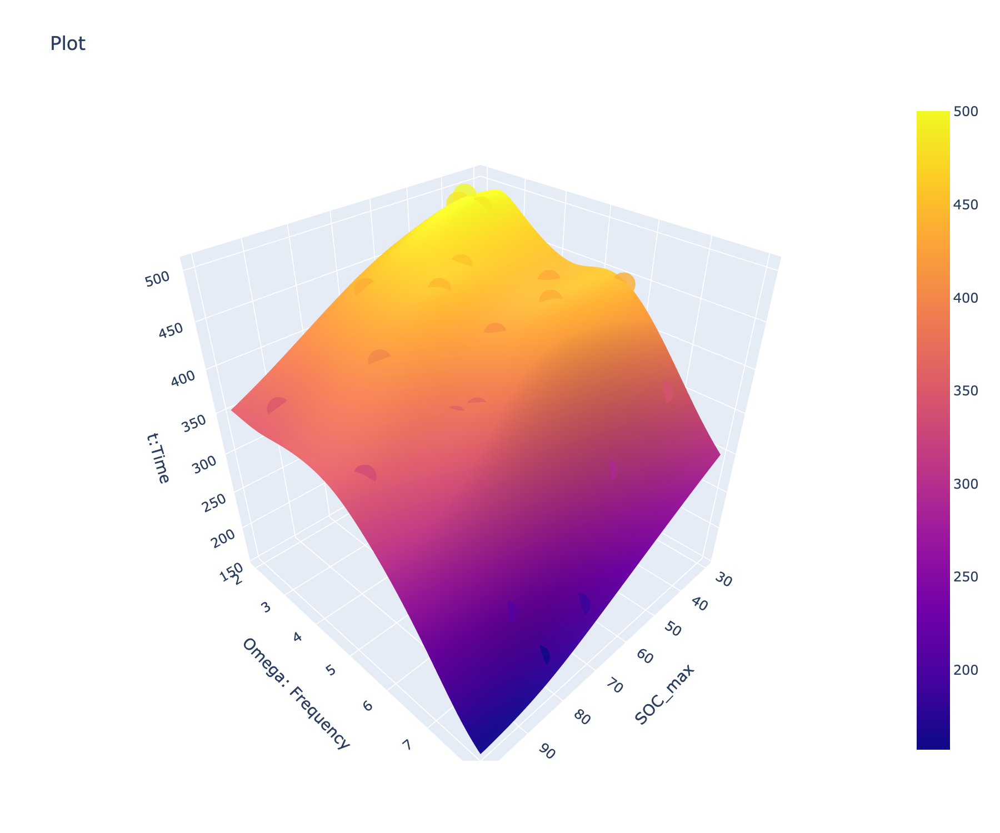
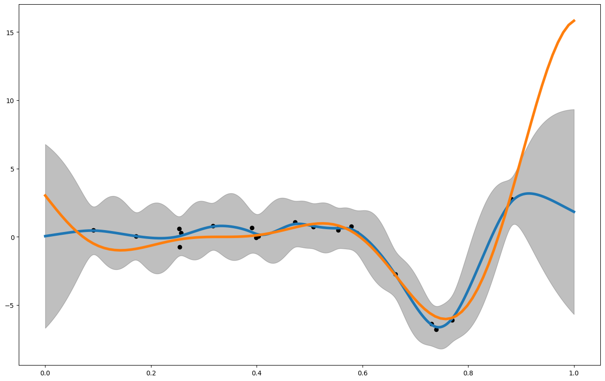

# Battery Cycle-Life Prediction with Gaussian Processes

Predicting lithium-ion battery durability under variable cycling conditions using Gaussian process regression, carried out at **Lawrence Berkeley National Laboratory** under the supervision of [Dr. Maher Alghalayini](https://scholar.google.com/citations?user=n3W8A4IAAAAJ). Built on [gpCAM](https://gpcam.lbl.gov/) and [fvGP](https://github.com/lbl-camera/fvGP), LBNL's Gaussian process libraries.


*GP posterior mean of cycle life t(SOC_max, ω): the time for a cell's state of health to degrade to 80%, as a function of the maximum state of charge and the cycling frequency. Spheres are the noisy training observations.*

## The problem

How long a battery lasts depends heavily on how it is cycled. We consider cells whose state of charge oscillates sinusoidally between 20% and a maximum SOC_max at frequency ω:

$$\text{SOC}(t) = \frac{\text{SOC}_{max} - 20}{2}\,\sin(2\pi\omega t) + \frac{\text{SOC}_{max} + 20}{2}$$

The quantity of interest is the **cycle life** t(SOC_max, ω): the time until the cell's state of health reaches 80%. Measuring this is expensive (each point is a long-running degradation experiment), so we want a **surrogate model** that predicts cycle life anywhere in the design space [30, 100]% x [2, 8] from a small number of noisy observations, together with calibrated uncertainty. Gaussian process regression is a natural fit: it is data-efficient, provides posterior variance for free, and its priors (kernel, mean function, noise model) encode physical assumptions explicitly.

In these notebooks the ground-truth degradation surface is a synthetic parametric model, which makes it possible to validate the GP surrogate exactly; the methodology carries over unchanged to experimental cycling data.

## What's inside

The notebooks build up from GP fundamentals on standard benchmarks to the battery model:

| Notebook | Content |
|----------|---------|
| `01_fvgp_tutorial.ipynb` | fvGP basics: fitting, customizing, and querying a GP |
| `02_gp_power_law.ipynb` | GP regression of a power-law relation (cycle number vs. feature), with posterior uncertainty |
| `03_gp_gramacy_lee.ipynb` | 1D benchmark: Gramacy & Lee function, RBF kernel |
| `04_gp_forrester.ipynb` | 1D benchmark: Forrester function; posterior mean and 95% band vs. ground truth |
| `05_gp_goldstein_price_2d.ipynb` | 2D benchmark: Goldstein-Price with noisy observations over a design space |
| `06_gp_2d_energy_model.ipynb` | 2D surrogate of an energy model driven by C-rate and temperature |
| `07_gp_2d_kernels_booth.ipynb` | Kernel study on the Booth function: RBF vs. rational quadratic, mean functions, noise, hyperparameter bounds |
| `08_battery_cycle_life_gp.ipynb` | The battery model: GP surrogate of t(SOC_max, ω) with trained hyperparameters (uses `helpers.py`) |


*A 1D GP posterior (blue) with its uncertainty band (gray) against the true function (orange): the model is confident near data and honest about uncertainty away from it.*

## Getting started

```bash
git clone https://github.com/MichelFaloughi/LBNL-Project.git
cd LBNL-Project
pip install -r requirements.txt
jupyter lab notebooks/
```

## Acknowledgements

This work was supervised by Dr. Maher Alghalayini at Lawrence Berkeley National Laboratory. The GP tooling ([gpCAM](https://gpcam.lbl.gov/), [fvGP](https://github.com/lbl-camera/fvGP)) is developed by the CAMERA group at LBNL.

## License

[MIT](LICENSE)
